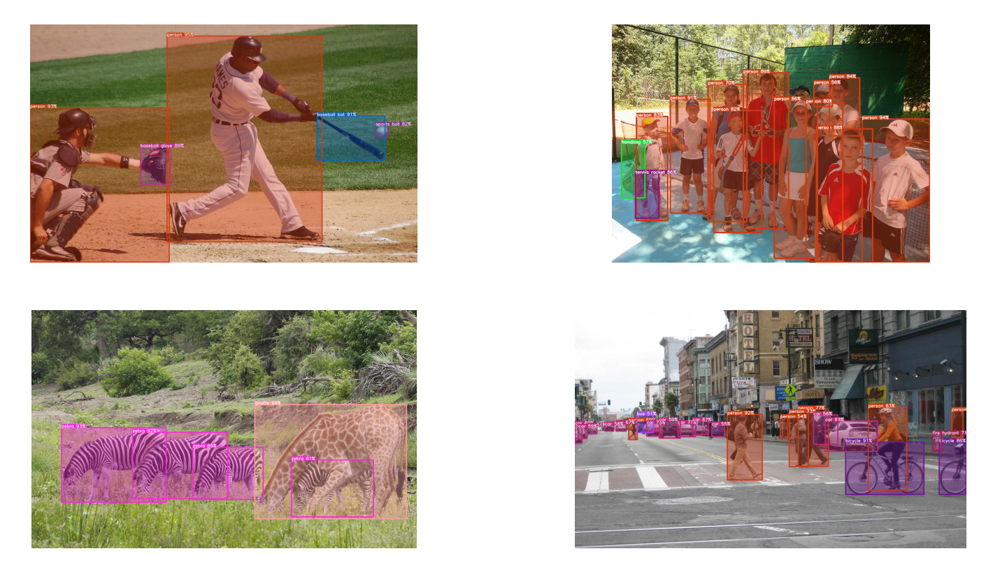
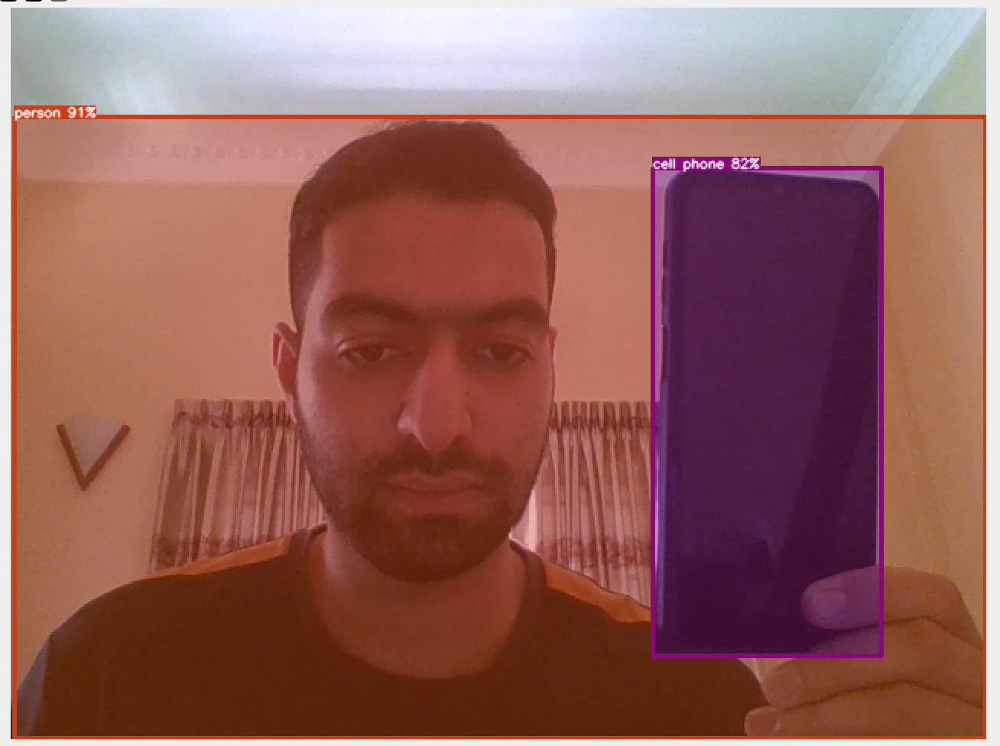

# YOLO V8
The project intends to use pre-trained model of **YOLOv8** and **OpenCV** for object detection in image, video, and webcam.

[**Reference**](https://github.com/ibaiGorordo/ONNX-YOLOv8-Object-Detection/tree/main)

## Results
  
<div align="center"><h3>Image and Webcam</h3></div>
<table>
<tr>
<td></td>
<td></td> 
</tr>
</table>

<div align="center"><h3>Video</h3></div>
<div>
<video width="320" height="240">
  <source src="results/result3.mp4" type="video/mp4">
</video>
</div>

https://github.com/amiralisahraei/machine-learning/assets/63749202/9f40ea0e-7aba-4072-88af-817c31f1ccae


## Run The Project
First of all you need to download the **yolov8m.onnx** which containes model architecture and weights.

[Download it here](https://colab.research.google.com/drive/1-yZg6hFg27uCPSycRCRtyezHhq_VAHxQ?usp=sharing)

Then install the necessary libraries

```bash
  pip install -r requirements.txt
```
To run YOLOYv8 for an image:
```bash
  python image_object_detection.py
```
To run YOLOYv8 for a video:
```bash
  python video_object_detection.py
```
To run YOLOYv8 for webcam:
```bash
  python webcam_object_detection.py
```
